Infrastructure for Startups

```mermaid
---
config:
  look: handDrawn
  layout: elk
  theme: neo
---
flowchart LR
    A["Plan 📝"] --> B["Code 💻"]
    B --> C["Build 🔧"]
    C --> D["Test 🔄"]
    D --> E["Release 🚀"]
    E --> F["Deploy 📦"]
    F --> G["Operate ⚙️"]
    G --> H["Monitor 📊"]
```

This repository provides a scalable, extensible and incredibly cheap way to host your infrastructure anywhere on the web.

Unlike recent, and traditional monolithic infrastructures that come with a lot of convinience, and are beginner friendly,
this setup doesn't couple you to any company or a product, and keep you entirely decoupled from opinionated services,
and unnecessary abstractions. 

Why:

* This setup is focued on [COGS](https://softwareequity.com/blog/cogs-in-saas/)
* It focuses on incredibly easy extensibility
* It doesn't couple you to any company or a services with unpredictable pricing
* It's been built with documentation being the first class citizen

<!--

**Here are some ideas to get you started:**

🙋‍♀️ A short introduction - what is your organization all about?
🌈 Contribution guidelines - how can the community get involved?
👩‍💻 Useful resources - where can the community find your docs? Is there anything else the community should know?
🍿 Fun facts - what does your team eat for breakfast?
🧙 Remember, you can do mighty things with the power of [Markdown](https://docs.github.com/github/writing-on-github/getting-started-with-writing-and-formatting-on-github/basic-writing-and-formatting-syntax)
-->
